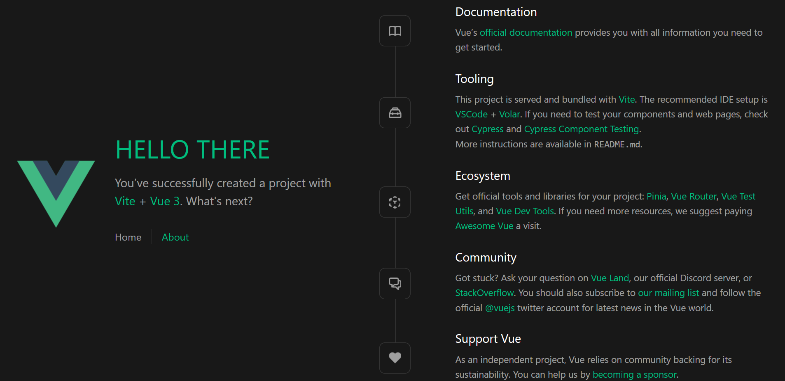

# HA Core with Vite + Vue

<strong>THIS REPO IS EXPERIMENTAL</strong>

## Features
- [X] HMR
- [X] Develop locally

Our frontend currently located in `homeassistant/components/ui/`

## Prerequisites
1. [Docker](https://www.docker.com/)
2. [pnpm](https://pnpm.io/id/)
   
## Development
1. execute `./dev` from the root folder

## TODO
- [ ] Fix HA auth
